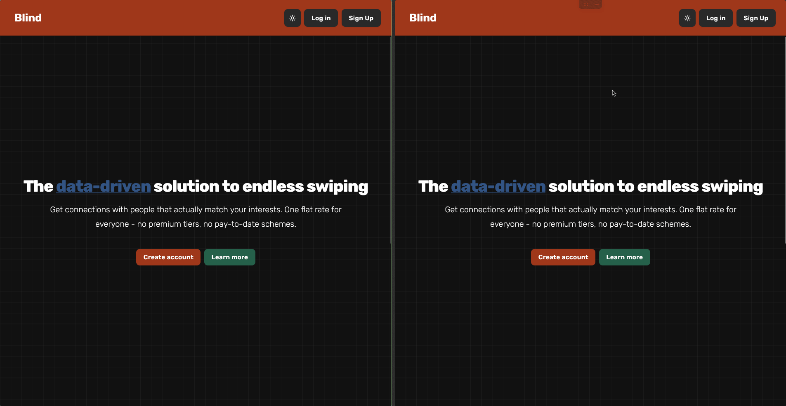

# Blind

A modern matching platform for connecting people.

## Preview



## Notes

❗ when running dev mode (not dockerized), it will generate 100 users from [backend](./back-end/src/main/java/com/matchme/srv/util/TestUserGenerator.java)

## Technologies Used

- **Frontend**: React, TypeScript, Vite
- **Backend**: Java, Spring Boot
- **Database**: PostgreSQL
- **Communication**: WebSockets
- **Containerization**: Docker

## Running Locally (Without Docker)

1. Create a `.env` file from `.env.example` with your configuration (in `front-end/` dir)
2. Make sure Postgres is running locally with proper credentials
3. Start the backend:
   ```
   cd back-end
   mvn spring-boot:run -Dspring-boot.run.profiles=dev
   ```
4. Start the frontend:
   ```
   cd front-end
   pnpm dev
   ```
5. Access the application at `http://localhost:3000`

## Running with Docker

1. Create a `.env` file from `.env.example` with your configuration (in root dir)
2. Start the application:
   ```
   make prod
   ```
3. To stop the application:
   ```
   make prod-down
   ```
4. Access the application at `http://localhost/`
